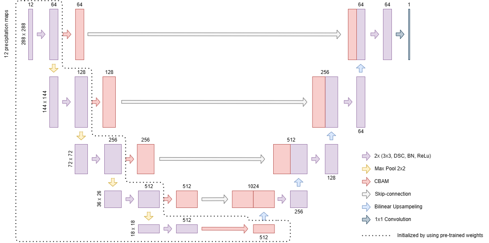
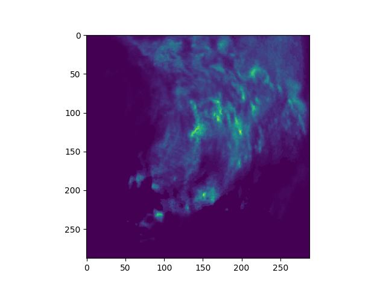

### MoCo-SmaAt-UNet

Code from paper "Application of self-supervised learning for precipitation nowcasting".
This code uses SSL models to learn meaningful representations from historical precipitation radar data. 
To this end, we pre-train the SmaAt-UNet encoder using MoCo v1 or MoCo v2 methods through specific data augmentations. 
The trained model will then be used in downstream tasks (weather elements nowcasting using radar data). 
We compared the MoCo-SmaAt-UNet with and without using self-supervised learning.



The proposed Moco-SmaAt-UNet can be found in the folder models under [MoCo_SmaAt_Unet.py](models%2FMoCo_SmaAt_Unet.py) .

### Precipitation dataset

We use a dataset based on radar precipitation maps from The Royal Netherlands Meteorological Institute (KNMI).
The dataset consists of precipitation maps in 5-minute intervals from 2016-2019. We use the dataset with 50%, which means with at least 50% of rainy pixels in the target images. The dataset has a size of 4GB. 
An example of image we use can be seen below:


### Self-supervised learning (pre-training of model)

This implementation only supports **multi-gpu**, **DistributedDataParallel** training, which is faster and simpler; single-gpu or DataParallel training is not supported.

To do unsupervised pre-training of a MoCo-SmaAt-UNet model on the precipitation dataset, run in google colab:
```
!python /content/Master_Thesis/main_moco.py \
  --lr 0.001 \
  --batch-size 32 \
  --dist-url 'tcp://localhost:10001' --multiprocessing-distributed --world-size 1 --rank 0 \
```
This script uses all the default hyperparameters as described in the MoCo v1 paper. To run MoCo v2, set `--mlp --moco-t 0.2 --aug-plus --cos`.

### Downstream task Precipitation using MoCo-SmaAt-UNet

After the pre-training with main_moco.py the training for the downstream task can be done, namely [train_precip_lightning.py]. The pre-trained weights are used for the downstream task, which can be run in google colab:
```
!python /content/Master_Thesis/train_precip_lightning.py --model 'SmaAt_UNet' --n_channels 12 --n_classes 1
```

After that the testing fase can take place, by running for testing all models in the folder comparison:
```
!python /content/Master_Thesis/test_precip_lightning.py
```
Or using this code for testing a particular checkpoint:
```
!python /content/Master_Thesis/cal_metrics_test_set.py
```

### Installing dependencies
```
!pip install pytorch-lightning==0.7.6
!pip install opencv-python
!pip install grad-cam
```
